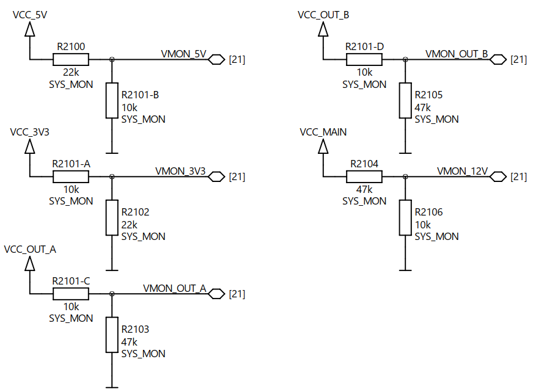
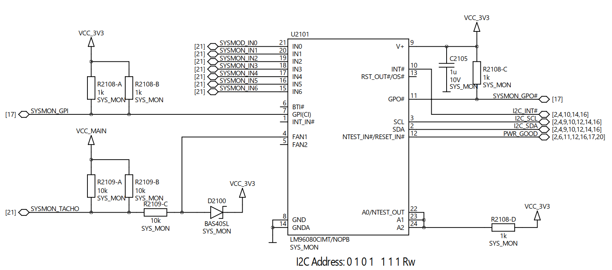
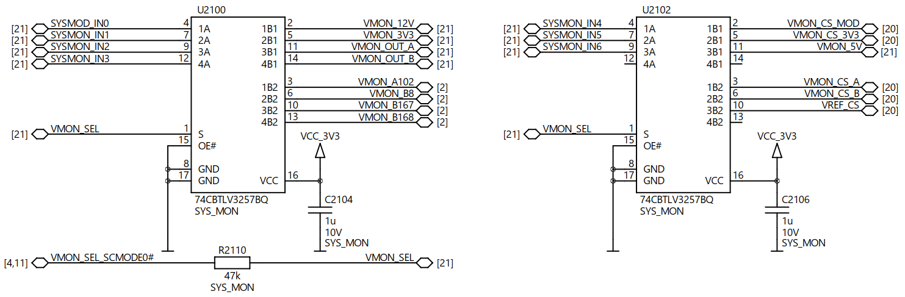
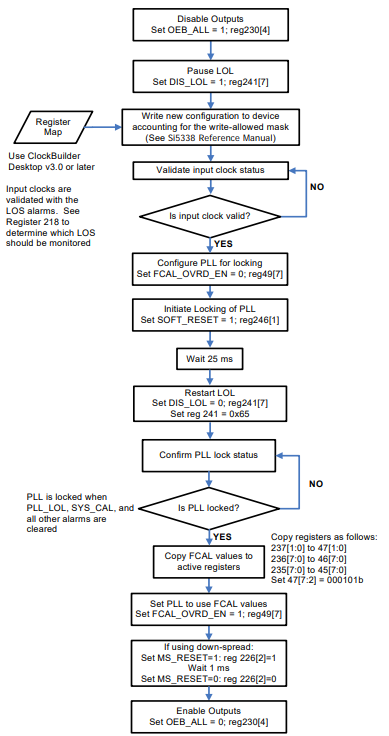

# Chapter 3 - Bare metal
This chapter describes the usage of the aforementioned devices with the I2C bus and provides sample code snippets for a bare metal application. It is assumed that the hardware used is set up correctly using the corresponding user manual for the hardware in use. The source files for the provided code snippets are also available, e.g. [I2cInterface.h](./code/BareMetal/I2cInterface/I2cInterface.h).

```c
/**
* \brief I2C subaddress modes.
*/
typedef enum
{
    EI2cSubAddressMode_None , ///< No subaddress
    EI2cSubAddressMode_OneByte , ///< One -byte subaddress
    EI2cSubAddressMode_TwoBytes ///< Two -byte subaddress
} EI2cSubAddressMode_t;

/**
* \brief Perform any required initialisation for I2C operations.
*
* @return Result code
*/

EN_RESULT InitialiseI2cInterface ();

/**
* \brief Perform a read from the I2C bus.
*
* \param[in] deviceAddress The device address
* \param[in] subAddress Register subaddress
* \param[in] subAddressMode Subaddress mode
* \param[in] numberOfBytesToRead The number of bytes to read
* \param[out] pReadBuffer Buffer to receive read data
* \returns Result code
*/
EN_RESULT I2cRead(uint8_t deviceAddress ,
    uint16_t subAddress ,
    EI2cSubAddressMode_t subAddressMode ,
    uint32_t numberOfBytesToRead ,
    uint8_t* pReadBuffer);

/**
* \brief Perform a write to the I2C bus.
*
* \param deviceAddress Device address
* \param subAddress Register subaddress
* \param subAddressMode Subaddress mode
* \param writeBuffer Buffer containing write data
* \param numberOfBytesToWrite The number of bytes to write
* \returns Result code
*/
EN_RESULT I2cWrite(uint8_t deviceAddress ,
    uint16_t subAddress ,
    EI2cSubAddressMode_t subAddressMode ,
    const uint8_t* pWriteBuffer ,
    uint32_t numberOfBytesToWrite);
```

## 3.1 - EEPROM
This section shows how to read data from the EEPROMs present on Enclustra hardware. Basic module information can be accessed this way. There are three different EEPROM chips used in Enclustra hardware which are described in more detail below.

### 3.1.1 - ATSHA204A-MAHDA-T
The ATSHA204A-MAHDA-T has different memory zones which can be accessed by the user with specific read and write properties: data, configuration and OTP zone. Each of these zones is then divided into blocks or slots which can be accessed individually. For more details about each zone please refer to the [data sheet](http://ww1.microchip.com/downloads/en/DeviceDoc/ATSHA204A-Data-Sheet-40002025A.pdf). The I2C address of the ATSHA204A-MAHDA-T is defined as ([excerpt of ModuleEeprom.c](./code/BareMetal/EEPROM/ModuleEeprom.c)):

```c
/// Atmel ATSHA204A
EEepromDevice_AtmelAtsha204a = 0x64 ,
```

### Initialization function
A wake token needs to be sent for the ATSHA204A-MAHDA-T before any communication can take place. A sufficient wake function is provided in the source code for the ATSHA204A-MAHDA-T [AtmelAtsha204a.c](./code/BareMetal/EEPROM/AtmelAtsha204a.c). When the device is not busy a sleep sequence should be issued to put the device into low-power mode. The following code excerpt sends the wake signal, confirms that the device is indeed the ATSHA204A-MAHDA-T and then sends the sleep sequence as suggested in the data sheet ([excerpt of ModuleEeprom.c](./code/BareMetal/EEPROM/ModuleEeprom.c)).

```c
case EEepromDevice_AtmelAtsha204a:
{
    // Send the wake token , and verify that the response confirms the device is an Atmel ATSHA204A.
    if (EN_FAILED(AtmelAtsha204a_Wake(true)))
    {
        *pDeviceIsPresent = false;
    }
    else
    {
        *pDeviceIsPresent = true;
        AtmelAtsha204a_Sleep ();
    }

break;
}
```

### Read serial number example
One information that is stored in the OTP zone at slot `0` is the serial number of Enclustra modules (among other configuration data). The variable setup is shown here ([excerpt of ModuleEeprom.c](./code/BareMetal/EEPROM/ModuleEeprom.c)):

```c
uint8_t readBuffer [4];
uint16_t encodedAddress = 0;

// Config data is stored in slot 0 of the OTP zone.
uint8_t slotIndex = 0;

// Serial number
uint8_t serialNumberWordOffset = (
MODULE_INFO_ADDRESS_SERIAL_NUMBER / 4);
```

Constant definitions can be found in [ModuleConfigConstants.h](./code/BareMetal/CommonFiles/ModuleConfigConstants.h). This is where the address for serial number information is defined for example. A read from the ATSHA204A-MAHDA-T consists of three steps:
* Get the encoded address for the memory zone you want to access.
* Perform the actual read operation using the obtained encoded address.
* Convert the byte array to a 32 bit unsigned integer for convenience.

```c
EN_RETURN_IF_FAILED(AtmelAtsha204a_EncodeAddress(EZoneSelect_Otp, slotIndex, serialNumberWordOffset, &encodedAddress));

EN_RETURN_IF_FAILED(AtmelAtsha204a_Read(EReadSizeSelect_4Bytes, EZoneSelect_Otp, encodedAddress, (uint8_t *)&readBuffer));

g_moduleSerialNumber = ByteArrayToUnsignedInt32 ((uint8_t *)& readBuffer);
```

The used encode address and read function are defined in the [AtmelAtsha204a.c](./code/BareMetal/EEPROM/AtmelAtsha204a.c) source file. The `AtmelAtsha204a_Read` function itself is divided into several steps:
* A command packet needs to be constructed according to the [data sheet](http://ww1.microchip.com/downloads/en/DeviceDoc/ATSHA204A-Data-Sheet-40002025A.pdf).
* The constructed command needs to be sent to the device. This includes a call of the wake function.
* The response of the device is checked performing a read data response function.
* After all operations are completed, the sleep command is issued.

### 3.1.2 - DS28CN01U-A00+
The I2C address of the DS28CN01U-A00+ is defined as ([excerpt of ModuleEeprom.c](./code/BareMetal/EEPROM/ModuleEeprom.c)):

```c
/// Maxim DS28CN01
EEepromDevice_MaximDs28cn01_0 = 0x5C ,

/// Maxim DS28CN01
EEepromDevice_MaximDs28cn01_1 = 0x50 ,
```

There are two different device addresses for the DS28CN01U-A00+ as this is not consistent on all Enclustra hardware. Please refer to the user manual for your specific device to check the correct address. There are two different communication modes for the DS28CN01U-A00+ which can be configured through these registers:

```c
/// Communications mode register address
#define DS28CN01_REGISTER_ADDRESS_COMMUNICATION_MODE 0xA8

/// Communication mode register value for I2C mode
#define DS28CN01_REGISTER_VALUE_COMMUNICATION_MODE_I2C 0x00
```

### Initialization function
The DS28CN01U-A00+ needs to be switched into I2C mode. A read back is performed to check if the communication mode change was successful ([excerpt of ModuleEeprom.c](./code/BareMetal/EEPROM/ModuleEeprom.c)).

```c
case EEepromDevice_MaximDs28cn01_0:
case EEepromDevice_MaximDs28cn01_1:
{
    // The Maxim DS28CN01 EEPROM needs to be switched into I2C mode by writing a zero to the communication mode
    // register.
    uint8_t communicationModeBuffer = DS28CN01_REGISTER_VALUE_COMMUNICATION_MODE_I2C;
    if (EN_FAILED(I2cWrite(eepromI2cAddress, DS28CN01_REGISTER_ADDRESS_COMMUNICATION_MODE,     EI2cSubAddressMode_OneByte, (uint8_t *)&communicationModeBuffer, sizeof(communicationModeBuffer))))
    {
        *pDeviceIsPresent = false;
        return EN_SUCCESS;
    }

    // Try to read from address 0 to see if the device responds.
    uint8_t readBuffer;
    if (EN_FAILED(I2cRead(eepromI2cAddress, 0, EI2cSubAddressMode_OneByte, sizeof (readBuffer), (uint8_t *)&readBuffer)))
    {
        *pDeviceIsPresent = false;
    }
    else
    {
        *pDeviceIsPresent = true;
    }

    break;
}
```

### Read functions
Read functions are implemented to get module information stored in the EEPROM ([excerpt of ModuleEeprom.c](./code/BareMetal/EEPROM/ModuleEeprom.c)).

```c
// Get the serial number
uint8_t readBuffer [4];
EN_RETURN_IF_FAILED(I2cRead(g_EepromDeviceType, MODULE_INFO_ADDRESS_SERIAL_NUMBER, EI2cSubAddressMode_OneByte, 4,(uint8_t *)&readBuffer));

g_moduleSerialNumber = ByteArrayToUnsignedInt32 (( uint8_t *)& readBuffer);

// Product number
EN_RETURN_IF_FAILED(I2cRead(g_EepromDeviceType, MODULE_INFO_ADDRESS_PRODUCT_NUMBER, EI2cSubAddressMode_OneByte, 4,(uint8_t *)&readBuffer));

uint32_t productNumber = ByteArrayToUnsignedInt32 (( uint8_t *)&readBuffer);
g_productNumberInfo = ParseProductNumber(productNumber);

// MAC address
uint8_t macAddressBuffer [6];
EN_RETURN_IF_FAILED(I2cRead(g_EepromDeviceType, MODULE_INFO_ADDRESS_MAC_ADDRESS, EI2cSubAddressMode_OneByte, 6,(uint8_t *)&macAddressBuffer));

g_macAddress = ByteArrayToUnsignedInt64 (( uint8_t *)& macAddressBuffer);
```

This code excerpt reads the serial number, product number and MAC address. The module configuration information can also be read via I2C by specifying the correct address and configuration property length in bytes, which is dependent on the hardware used ([excerpt of ModuleEeprom.c](./code/BareMetal/EEPROM/ModuleEeprom.c)).

```c
EN_RETURN_IF_FAILED(I2cRead(g_EepromDeviceType, CONFIG_PROPERTIES_START_ADDRESS, EI2cSubAddressMode_OneByte, CONFIG_PROPERTIES_LENGTH_BYTES, pConfigData));
```

### 3.1.3 - 24AA128T-I/MNY
The 24AA128T-I/MNY EEPROM is completely available for user data. No special initialization of the device is needed. The standard I2C read and write functions can be used to communicate with the EEPROM.

## 3.2 - RTC
This section shows how to use each respective RTC chip for time, date and (if available) temperature readings. Before going into detail there are some helper functions that are declared.

### 3.2.1 - Helper functions
Conversion functions from binary coded decimal to decimal and vice versa are helpful for reading and setting sensor values ([excerpt of UtilityFunctions.h](./code/BareMetal/CommonFiles/UtilityFunctions.h)).

```c
/**
* \brief Convert decimal to binary coded decimal.
*
* @param decimal Decimal input
* @return Corresponding binary coded decimal value
*/
static inline uint8_t ConvertDecimalToBinaryCodedDecimal(int decimal)
{
    return (( decimal / 10) << 4) + (decimal % 10);
}


/**
* \brief Convert binary coded decimal to decimal.
*
* @param bcd Binary coded decimal
* @return Corresponding decimal value
*/
static int ConvertBinaryCodedDecimalToDecimal(uint8_t bcd)
{
    return ((bcd >> 4) * 10) + bcd % 16;
}
```

### 3.2.2 - ISL12020M
First, the I2C addresses of the device and relevant registers are defined.

### I2C address definition
The I2C address of the ISL12020M chip is defined as ([excerpt from RealtimeClock.c](./code/BareMetal/RTC/RealtimeClock.c)):

```c
/// Intersil ISL12020
ERtcDevice_ISL12020 = 0x6F,
```

The subaddresses of the individual registers are defined corresponding to the data sheet.

```c
/// Register address for seconds
#define ISL12020_REGISTER_ADDRESS_SECONDS 0x00

/// Register address for minutes
#define ISL12020_REGISTER_ADDRESS_MINUTES 0x01

/// Register address for hours
#define ISL12020_REGISTER_ADDRESS_HOUR 0x02

/// Register address for day
#define ISL12020_REGISTER_ADDRESS_DAY 0x03

/// Register address for month
#define ISL12020_REGISTER_ADDRESS_MONTH 0x04

/// Register address for year
#define ISL12020_REGISTER_ADDRESS_YEAR 0x05

/// Register address for temperature value 0
#define ISL12020_REGISTER_ADDRESS_TEMPERATURE1 0x28

/// Register address for temperature value 1
#define ISL12020_REGISTER_ADDRESS_TEMPERATURE2 0x29
```

After defining all the addresses for the relevant registers an initialization function is used to start the operation of the RTC chip.

### Initialization function
For the ISL12020M to start counting, the write enable bit (`WRTC`) must be set (the default value on power up is `0` and only after the completion of a valid write, the RTC starts counting):

```c
// Enable write access
// Disable Frequency Output
uint8_t writeEnable = 0x40;
EN_RETURN_IF_FAILED(I2cWrite(ERtcDevice_ISL12020, 0x08, EI2cSubAddressMode_OneByte, &writeEnable, 1));
```

To enable the temperature sensor the `TSE` bit must be set (default value on power up is `0`):

```c
/** Enable temp sense:
* read the register value
* set bit 8 (TSE) in register at address 0x0D
* write it back
*/
uint8_t configRegister;
EN_RETURN_IF_FAILED(I2cRead(ERtcDevice_ISL12020, 0x0D, EI2cSubAddressMode_OneByte, 1, &configRegister));

configRegister = configRegister | 0x80;

EN_RETURN_IF_FAILED(I2cWrite(ERtcDevice_ISL12020, 0x0D, EI2cSubAddressMode_OneByte, &configRegister, 1));
```

### Read and set functions
The definition of read and set functions is shown below. The helper functions defined in [3.2.1](Chapter-3-BareMetal.md#321-helper-functions) are used for conversion of binary coded decimal values to decimal values and vice versa.

### Read and set time
The following code excerpts can be found in [RealtimeClock.c](./code/BareMetal/RTC/RealtimeClock.c).

```c
EN_RESULT Rtc_ReadTime(int* pHour , int* pMinutes , int* pSeconds)
{
    if (pHour == NULL || pMinutes == NULL || pSeconds == NULL)
    {
        return EN_ERROR_NULL_POINTER;
    }

    //read seconds value from register and convert it to decimal
    uint8_t binaryCodedSeconds;
    EN_RETURN_IF_FAILED( I2cRead(g_RtcDeviceType, g_secondsRegisterAddress, EI2cSubAddressMode_OneByte, 1, &    binaryCodedSeconds));
    *pSeconds = ConvertBinaryCodedDecimalToDecimal (binaryCodedSeconds);

    //read minutes value from register and convert it to decimal
    uint8_t binaryCodedMinutes;
    EN_RETURN_IF_FAILED(I2cRead(g_RtcDeviceType, g_minutesRegisterAddress, EI2cSubAddressMode_OneByte , 1, &    binaryCodedMinutes));
    *pMinutes = ConvertBinaryCodedDecimalToDecimal (binaryCodedMinutes);

    //read hour value from register and convert it to decimal
    uint8_t binaryCodedHour;
    EN_RETURN_IF_FAILED(I2cRead(g_RtcDeviceType, g_hourRegisterAddress, EI2cSubAddressMode_OneByte, 1, &binaryCodedHour));

    /** 0x3F mask is needed since only the first 6 bits of the register contain the individual values and the 8th bit of    the register can be used to switch between 24 hour and 12 hour mode , so it needs to be excluded from the conversion*/
    *pHour = ConvertBinaryCodedDecimalToDecimal (binaryCodedHour & 0x3F);

    return EN_SUCCESS;
}
```

```c
EN_RESULT Rtc_SetTime(int hour , int minutes , int seconds)
{
    // convert decimal to binary coded decimal
    uint8_t binaryCodedHour = ConvertDecimalToBinaryCodedDecimal (hour);
    uint8_t binaryCodedMinutes = ConvertDecimalToBinaryCodedDecimal (minutes);
    uint8_t binaryCodedSeconds = ConvertDecimalToBinaryCodedDecimal (seconds);

    binaryCodedHour |= 0x80; // enable 24h format

    //set seconds value
    EN_RETURN_IF_FAILED(
    I2cWrite(g_RtcDeviceType, g_secondsRegisterAddress, EI2cSubAddressMode_OneByte, &binaryCodedSeconds, 1));

    //set minutes value
    EN_RETURN_IF_FAILED(
    I2cWrite(g_RtcDeviceType, g_minutesRegisterAddress, EI2cSubAddressMode_OneByte, &binaryCodedMinutes, 1));

    //set hour value
    EN_RETURN_IF_FAILED(
    I2cWrite(g_RtcDeviceType, g_hourRegisterAddress, EI2cSubAddressMode_OneByte, &binaryCodedHour , 1));

    return EN_SUCCESS;
}
```

### Read and set date
```c
EN_RESULT Rtc_ReadDate(int* pDay , int* pMonth , int* pYear)
{
    if (pDay == NULL || pMonth == NULL || pYear == NULL)
    {
        return EN_ERROR_NULL_POINTER;
    }

    uint8_t binaryCodedDay;
    EN_RETURN_IF_FAILED(I2cRead(g_RtcDeviceType, g_dayRegisterAddress, EI2cSubAddressMode_OneByte, 1, &ryCodedDay));
    *pDay = ConvertBinaryCodedDecimalToDecimal (binaryCodedDay);

    uint8_t binaryCodedMonth;
    EN_RETURN_IF_FAILED(I2cRead(g_RtcDeviceType, g_monthRegisterAddress, EI2cSubAddressMode_OneByte, 1, &binaryCodedMonth));
    *pMonth = ConvertBinaryCodedDecimalToDecimal (binaryCodedMonth);

    uint8_t binaryCodedYear;
    EN_RETURN_IF_FAILED(I2cRead(g_RtcDeviceType, g_yearRegisterAddress, EI2cSubAddressMode_OneByte, 1, &binaryCodedYear));
    *pYear = ConvertBinaryCodedDecimalToDecimal (binaryCodedYear);

    return EN_SUCCESS;
}
```

```c
EN_RESULT Rtc_SetDate(int day , int month , int year)
{

    uint8_t binaryCodedDay = ConvertDecimalToBinaryCodedDecimal (day);
    uint8_t binaryCodedMonth = ConvertDecimalToBinaryCodedDecimal (month);
    uint8_t binaryCodedYear = ConvertDecimalToBinaryCodedDecimal (year);

    EN_RETURN_IF_FAILED(I2cWrite(g_RtcDeviceType, g_dayRegisterAddress, EI2cSubAddressMode_OneByte, &binaryCodedDay, 1));

    EN_RETURN_IF_FAILED(I2cWrite(g_RtcDeviceType, g_monthRegisterAddress, EI2cSubAddressMode_OneByte, &binaryCodedMonth, 1));

    EN_RETURN_IF_FAILED(I2cWrite(g_RtcDeviceType, g_yearRegisterAddress, EI2cSubAddressMode_OneByte, &binaryCodedYear, 1));

    return EN_SUCCESS;
}
```

### Read temperature
The temperature value is stored in 2 registers located at address `0x28` and `0x29`. The two temperature values are then `TK[7:0]` (LSBs) and `TK[9:8]` (MSBs). In order to get the temperature in Celsius equation 1 needs to be used given in the data sheet.


```c
EN_RESULT Rtc_ReadTemperature(int* pTemperatureCelsius)
{
    if (pTemperatureCelsius == NULL)
    {
        return EN_ERROR_NULL_POINTER;
    }

    if (g_RtcDeviceType == ERtcDevice_NXPPCF85063A)
    {
        return EN_ERROR_RTC_FEATURE_NOT_SUPPORTED;
    }

    /**temperature value is 2 bytes , therefore we need two uint8_t variables
    */
    uint8_t value0;
    uint8_t value1;

    //read both values
    EN_RETURN_IF_FAILED(I2cRead(g_RtcDeviceType, ISL12020_REGISTER_ADDRESS_TEMPERATURE1, EI2cSubAddressMode_OneByte , 1, &value0));
    EN_RETURN_IF_FAILED(I2cRead(g_RtcDeviceType, ISL12020_REGISTER_ADDRESS_TEMPERATURE2, EI2cSubAddressMode_OneByte , 1, &value1));

    /**calculate the temperature in celsius using the read values according to the data sheet; value1 needs to be   shifted 8 bits to the left as the bottom two bits of the register at ISL12020_REGISTER_ADDRESS_TEMPERATURE2 hold the  MSBs of the combined value */
    *pTemperatureCelsius = (value0 + (value1 <<8)) / 2 - 273;

    return EN_SUCCESS;
}
```

### 3.2.3 - PCF85063A
The I2C address of the PCF85063A chip is defined as:

```c
/// NXP PCF85063A
ERtcDevice_NXPPCF85063A = 0x51 ,
```

The subaddresses of the individual registers are defined corresponding to the data sheet. The following code excerpts can be found in [RealtimeClock.c](./code/BareMetal/RTC/RealtimeClock.c).

```c
/// Register address for seconds
#define PCF85063A_REGISTER_ADDRESS_SECONDS 0x04

/// Register address for minutes
#define PCF85063A_REGISTER_ADDRESS_MINUTES 0x05

/// Register address for hours
#define PCF85063A_REGISTER_ADDRESS_HOUR 0x06

/// Register address for day
#define PCF85063A_REGISTER_ADDRESS_DAY 0x07

/// Register address for month
#define PCF85063A_REGISTER_ADDRESS_MONTH 0x09

/// Register address for year
#define PCF85063A_REGISTER_ADDRESS_YEAR 0x0A
```

### Initialization function
Set the desired bits in the configuration register (in this case 24 hour mode and setting oscillator capacity).

```c
// Enable 24-hour mode and set oscillator capacity
uint8_t configRegister = 0;
EN_RETURN_IF_FAILED(I2cRead(ERtcDevice_NXPPCF85063A, 0x00, EI2cSubAddressMode_OneByte, 1, &configRegister));

configRegister = configRegister | 0x01;

EN_RETURN_IF_FAILED(I2cWrite(ERtcDevice_NXPPCF85063A, 0x00, EI2cSubAddressMode_OneByte, &configRegister , 1));
```

### Adjustments to read and set functions
The same read and set functions described in section [3.2.1](Chapter-3-BareMetal#321-helper-functions) can be used with the PCF85063A. The PCF85063A does not have a temperature sensor.

## 3.3 - System Controller Lattice LCMXO2-4000HC-6MG132I
The system controller can be used to switch between different measurement modes by providing the control signal for the system monitor multiplexers. This mode can be changed via I2C. The I2C address of the LCMXO2-4000HC-6MG132I chip is defined as ([excerpt of SystemController.c](./code/BareMetal/SystemController/SystemController.c)):

```c
#define SYSTEM_CONTROLLER_DEVICE_ADDRESS 0x0D
```

The subaddresses for the control registers are defined in the following code snippet:

```c
#define SYSTEM_CONTROLLER_REGISTER_ADDRESS_VMON_SEL 20
#define SYSTEM_CONTROLLER_REGISTER_ADDRESS_VMON_SEL_EN 21
```

A set function for the control signal is implemented:

```c
EN_RESULT SystemController_SetVmonSel(int set_bit)
{
    uint8_t tempValue = 0;
    EN_RETURN_IF_FAILED(I2cRead(SYSTEM_CONTROLLER_DEVICE_ADDRESS, SYSTEM_CONTROLLER_REGISTER_ADDRESS_VMON_SEL,    EI2cSubAddressMode_OneByte, 1, (uint8_t *)&tempValue));

    //Set/Reset Bit 2 of Register 20 --> set Vmon_Sel to 1/0
    if (set_bit) {
        tempValue |= (1 << 2);
    }
    else {
        tempValue &= ~(1 << 2);
    }

    EN_RETURN_IF_FAILED(I2cWrite(SYSTEM_CONTROLLER_DEVICE_ADDRESS, SYSTEM_CONTROLLER_REGISTER_ADDRESS_VMON_SEL,    EI2cSubAddressMode_OneByte, &tempValue, 1));

    tempValue = 0;
    EN_RETURN_IF_FAILED(I2cRead(SYSTEM_CONTROLLER_DEVICE_ADDRESS, SYSTEM_CONTROLLER_REGISTER_ADDRESS_VMON_SEL_EN,    EI2cSubAddressMode_OneByte, 1, (uint8_t *)&tempValue));

    //Set Bit 2 of Register 21 --> set Vmon_Sel Enable to 1
    tempValue |= (1 << 2);

    EN_RETURN_IF_FAILED(I2cWrite(SYSTEM_CONTROLLER_DEVICE_ADDRESS, SYSTEM_CONTROLLER_REGISTER_ADDRESS_VMON_SEL_EN,EI2cSubAddressMode_OneByte, &tempValue, 1));

    SleepMilliseconds (750);
}
```

## 3.4 - System Monitor LM96080CIMT/NOPB
The I2C address of the LM96080CIMT/NOPB chip is defined as ([SystemMonitor.c](./code/BareMetal/SystemMonitor/SystemMonitor.c)):

```c
#define SYSTEM_MONITOR_DEVICE_ADDRESS 0x2F
```

The subaddresses of the individual registers are defined corresponding to the [data sheet](https://www.ti.com/lit/ds/symlink/lm96080.pdf).

```c
// Configuration Register
#define SYSTEM_MONITOR_REGISTER_ADDRESS_CONFIG 0x00

// Interrupt Status Register 1
#define SYSTEM_MONITOR_REGISTER_ADDRESS_INTR_STATUS_1 0x01

// Interrupt Status Register 2
#define SYSTEM_MONITOR_REGISTER_ADDRESS_INTR_STATUS_2 0x02

// Interrupt Mask Register 1
#define SYSTEM_MONITOR_REGISTER_ADDRESS_INTR_MASK_1 0x03
000-203-006 23 / 43 Version 01, 05.11.2020

// Interrupt Mask Register 2
#define SYSTEM_MONITOR_REGISTER_ADDRESS_INTR_MASK_2 0x04

// Fan Divisor / RTS_OUT / OS Register
#define SYSTEM_MONITOR_REGISTER_ADDRESS_FAN_DIV 0x05

// OS Configuration/Temperature Resolution Register
#define SYSTEM_MONITOR_REGISTER_ADDRESS_OS_CONFIG 0x06

// Conversion Rate Register
#define SYSTEM_MONITOR_REGISTER_ADDRESS_CONV_RATE 0x07

// Channel Disable Register
#define SYSTEM_MONITOR_REGISTER_ADDRESS_CHAN_DISABLE 0x08

// Value RAM Base Address
#define SYSTEM_MONITOR_REGISTER_ADDRESS_VALUE_BASE 0x20
```

After defining all the addresses for the relevant registers an initialization function is used to start the operation of the system monitor.

### Initialization function
The subsequent steps show the initialization process of the system monitor and set the START bit of the configuration register. This starts the monitoring process of all analog inputs, temperature and fan speed inputs. For more details about the monitoring sequence please refer to the [data sheet](https://www.ti.com/lit/ds/symlink/lm96080.pdf).

```c
EN_RESULT SystemMonitor_Initialise ()
{
    uint8_t Value = 0;

    /** Write interrupt mask register 1: Value = 0xFF disables all interrupt status bits */
    Value = 0xFF;
    EN_RETURN_IF_FAILED(I2cWrite(SYSTEM_MONITOR_DEVICE_ADDRESS, SYSTEM_MONITOR_REGISTER_ADDRESS_INTR_MASK_1 ,   EI2cSubAddressMode_OneByte, &Value, 1));

    /** Write interrupt mask register 2: Value = 0xFF disables interrupt status bits 0 to 6, setting bit 7 and bit 8 to 1 selects the one time interrupt mode for hot temperature and over temperature shutdown (OS) respectively */
    Value = 0xFF;
    EN_RETURN_IF_FAILED(I2cWrite(SYSTEM_MONITOR_DEVICE_ADDRESS, SYSTEM_MONITOR_REGISTER_ADDRESS_INTR_MASK_2,    EI2cSubAddressMode_OneByte, &Value, 1));

    /** Set OS Configuration/Temperature Resolution Register bit 4 to 1 in order to select the 11-bit plus sign     resolution temperature conversion */
    Value = 0x09;

    EN_RETURN_IF_FAILED(I2cWrite(SYSTEM_MONITOR_DEVICE_ADDRESS, SYSTEM_MONITOR_REGISTER_ADDRESS_OS_CONFIG,    EI2cSubAddressMode_OneByte, &Value, 1));
    // Set continuous conversion
    Value = 0x01;
    EN_RETURN_IF_FAILED(I2cWrite(SYSTEM_MONITOR_DEVICE_ADDRESS, SYSTEM_MONITOR_REGISTER_ADDRESS_CONV_RATE,    EI2cSubAddressMode_OneByte, &Value, 1));
    /** Start monitoring process by setting bit 0 of the Configuration Register to 1 */
    Value = 0x01;
    EN_RETURN_IF_FAILED(I2cWrite(SYSTEM_MONITOR_DEVICE_ADDRESS, SYSTEM_MONITOR_REGISTER_ADDRESS_CONFIG,    EI2cSubAddressMode_OneByte, &Value, 1));

    // Wait until the system monitor is ready
    SleepMilliseconds (500);

    return EN_SUCCESS;
}
```

After initialization of the system monitor read functions need to be implemented to access all of the monitored values such as voltages, currents and temperature.

### Read function
A generic read function is implemented to provide access to any of the value registers of the system monitor starting at address `0x20` until `0x3F`.

```c
EN_RESULT SystemMonitor_ReadValue(uint16_t channel , uint16_t* pValue)
{
    EN_RETURN_IF_FAILED(I2cRead(SYSTEM_MONITOR_DEVICE_ADDRESS, SYSTEM_MONITOR_REGISTER_ADDRESS_VALUE_BASE +channel, EI2cSubAddressMode_OneByte, 2, (uint8_t *) pValue));

    return EN_SUCCESS;
}
```

The read voltage function reads the relevant registers and converts the obtained value to mV. The values of the parameters RUpper and RLower are dependent on the base board used. An example for the Mercury XU5 module and the Mercury PE1 base board is shown in [Mercury XU5 example with Mercury PE1 base board](Chapter-3-BareMetal.md#mercury-xu5-example-with-mercury-pe1-base-board).

```c
EN_RESULT SystemMonitor_ReadVoltage(uint16_t channel , int* pVoltage , int RUpper , int RLower)
{
    uint16_t tempValue;
    EN_RETURN_IF_FAILED(I2cRead(SYSTEM_MONITOR_DEVICE_ADDRESS, SYSTEM_MONITOR_REGISTER_ADDRESS_VALUE_BASE +channel, EI2cSubAddressMode_OneByte, 2, (uint8_t *)&tempValue));

    // Convert value to voltage
    tempValue = (tempValue << 8) | (tempValue >> 8);
    // Only the first 10 bits contain the value
    tempValue = tempValue >> 6;

    if ( RLower != 1 )
    {
        /** from voltage divider formula; the constant 2.5 corresponds to
        2.5 mV LSB weighting from the data sheet */
        *pVoltage = (tempValue * 2.5 * (RUpper + RLower) / RLower);
    } else {
        /**no divider to ground - the voltage is more or less the same (depending on the current through RUpper resistor)   */
        *pVoltage = (tempValue * 2.5 );
    }

    return EN_SUCCESS;
}
```

For the current the function looks as follows:

```c
EN_RESULT SystemMonitor_ReadCurrent(uint16_t channel , int* pCurrent , int RShunt , int vRef)
{
    uint16_t tempValue = 0;
    EN_RETURN_IF_FAILED(I2cRead(SYSTEM_MONITOR_DEVICE_ADDRESS ,
    SYSTEM_MONITOR_REGISTER_ADDRESS_VALUE_BASE +channel ,
    EI2cSubAddressMode_OneByte ,
    2,
    (uint8_t *)&tempValue));

    // Convert value to voltage
    tempValue = (tempValue << 8) | (tempValue >> 8);
    // Only the first 10 bits contain the value
    tempValue = tempValue >> 6;
    /** Calculate current value: I=U/R; 100 is the gain of the current shunt monitor TI INA 199; the value of RShunt is given in integer and needs to be converted to mOhm , thus the factor 0.001; vRef is typically 0 V*/
    *pCurrent = ((( tempValue * 2.5) - vRef) / (100 * (0.001 * RShunt)));

    return EN_SUCCESS;
}
```

### Mercury XU5 example with Mercury PE1 base board
The relevant section of the PE1 base board schematic are shown below.





If `VCC_5V` wants to be monitored, the value for `RUpper` is `22 kΩ` and for `RLower` is `10 kΩ` (corresponding to resistors `R2100` and `R2101-B`). Different voltages and currents can be measured by changing the control signal of the analog multiplexers shown below through the system controller.



A set function for the system controller is shown in detail in section [3.3 - System Controller Lattice LCMXO2-4000HC-6MG132I](Chapter-3-BareMetal.md#33-system-controller-lattice-lcmx02-4000hc-6mg123i)

## 3.5 - Clock Generator Si5338
Silicon Labs provides a tool to configure and generate a C source code template defining all registers with vthe chosen configuration of the tool ([ClockBuilder Pro software](https://www.silabs.com/developers/clockbuilder-pro-software)). For download and install instructions please refer to the Silicon Labs website.

### 3.5.1 - I2C programming procedure
Silicon Labs advises to follow the I2C programming procedure shown in the figure below. To generate the register
map file the ClockBuilder Pro software can be used.



### 3.5.2 - Example configuration with Silicon Labs ClockBuilder Pro
This section shows an example of how the ClockBuilder Pro software can be used to create a configuration
register map for the Si5338.
  1. Start the ClockBuilder Pro software.
  2. Create a new project using the GUI.
  3. Click on Clock Generators, select the Si5338 chip and go through the configuration steps
  4. For `Universal Pin Configuration` leave the default setting as `IN3 (CLKIN); IN4 (FDBK)`
  5. For `Supply Voltages and Host Interface` leave the default values (I2C address: `0x70` and I2c Bus Voltage: `2.5/3.3V`)
  6. For `Input Clocks` set input pins to `IN1/2`, `Type/Format` and frequency to your application
  7. For Enable the output clocks necessary to your application.    
  8. For `Output Driver` as required by your application
  9. Leave `Frequency and Phase Offset` as required by your application
  10. Leave `Spread Spectrum` as required by your application
After all of the configuration is done, the project should be saved using the ”Save Design to Project File” option. Using the ”Export” option and navigating to ”Register File” a register map in C code format can be generated and saved as a C header file. The file for this particular configuration is available as an example with the provided source code ([Si5338_register_map.h](./code/BareMetal/ClockGenerator/Si5338_register_map.h)).

### 3.5.3 - Initialization
On startup of the hardware, the default Enclustra configuration is used for the clock generator. Therefore, no initialization function is needed. A simple check if the device is present can be performed to confirm the device address.

```c
// Try to read from register at address 0 to see if the device is present on the specified device address
EN_RESULT ClkGen_Initialise(bool* pDeviceIsPresent) 
{
    if (pDeviceIsPresent == NULL)
    {
        return EN_ERROR_NULL_POINTER;
    }

    uint8_t readBuffer;
    if (EN_FAILED(I2cRead(CLOCK_GENERATOR_DEVICE_ADDRESS, 0, EI2cSubAddressMode_OneByte, sizeof(readBuffer), uint8_t *)& readBuffer)))
    {
        *pDeviceIsPresent = false;
        EN_PRINTF("Device not present at address: 0x%x \n\r",
        CLOCK_GENERATOR_DEVICE_ADDRESS);
    }
    else
    {
        *pDeviceIsPresent = true;
        EN_PRINTF("Device present at address: 0x%x \n\r",
        CLOCK_GENERATOR_DEVICE_ADDRESS);
    }

    return EN_SUCCESS;
}
```

### 3.5.4 - Read function
The read function enables reading all of the available data of the Si5338. This is done by reading the first page of the configuration registers, sending a write to change the page and then reading the second page. These two reads are then concatenated into one read buffer and printed to console. For more details please refer to the provided code for the clock generator. The read function itself is just for debugging purposes.

### 3.5.5 - Write function
To change the configuration of the Si5338 via I2C a write function is implemented. This write function uses the generated C source code file from the ClockBuilder Pro software. Check the comments for explanation about each code snippet, which closely follow the suggested flow.

## 3.6 - 8-channel bus multiplexer NXP PCA9547
Channel `0` of the device is connected automatically on power up allowing immediate communication between master and the device connected to channel `0`. The control register is used to switch between the channels. Setting the four LSBs of the control register select the active channel.

### 3.6.1 - I2C address definition
The I2C address of the PCA9547 chip is defined as ([Multiplexer.c](./code/BareMetal/Multiplexer/Multiplexer.c)):

```c
#define MULTIPLEXER_DEVICE_ADDRESS 0x74
```

### 4.6.2 - Initialization
No specific initialization function is needed as the PCA9547 connects automatically to channel 0 on power up. To check that the address is set correctly, the chip can be probed after startup of the system.

```c
// Try to read from register at address 0 to see if the device is present on the specified device address
EN_RESULT Mux_Initialise(bool* pDeviceIsPresent) 
{
    if (pDeviceIsPresent == NULL)
    {
        return EN_ERROR_NULL_POINTER;
    }

    uint8_t readBuffer;
    if (EN_FAILED(
    I2cRead(MULTIPLEXER_DEVICE_ADDRESS, 0, EI2cSubAddressMode_OneByte, sizeof(readBuffer), (uint8_t *)&readBuffer)))
    {
        *pDeviceIsPresent = false;
        EN_PRINTF("Device not present at address: 0x%x \n\r", MULTIPLEXER_DEVICE_ADDRESS);
    }
    else
    {
        *pDeviceIsPresent = true;
        EN_PRINTF("Device present at address: 0x%x \n\r", MULTIPLEXER_DEVICE_ADDRESS);
    }

    return EN_SUCCESS;
}
```

### 4.6.3 - Read function
A basic I2C read is performed to get the current content of the configuration register. After initial system start the read value should be 0x08 as defined in the [data sheet](https://www.nxp.com/docs/en/data-sheet/PCA9547.pdf). Only the four LSBs are relevant, therefore the read buffer is concatenated with a read mask.

```c
EN_RESULT Mux_Read(uint8_t* readBuffer) 
{
// check the currently active channel by reading the contents of the configuration register
EN_RETURN_IF_FAILED(I2cRead(MULTIPLEXER_DEVICE_ADDRESS, 0x00, EI2cSubAddressMode_OneByte, 1, (uint8_t *)&readBuffer));

// only four LSBs hold relevant bits
*readBuffer = *readBuffer & READ_CONFIGURATION_REGISTER_MASK;

return EN_SUCCESS;
}
```

### 4.6.4 - Write function
A basic I2C write is performed to change the selected channel. It can also be used to reset the multiplexer to its default state by writing `0x08`.

```c
EN_RESULT Mux_Write(uint8_t writeBuffer) 
{

    // select the desired channel via writing to the configuration register

    // 0x08 to set bit 4th LSB , which is the output enable bit
    writeBuffer = writeBuffer | 0x08;

    EN_RETURN_IF_FAILED(I2cWrite(MULTIPLEXER_DEVICE_ADDRESS, 0x00, EI2cSubAddressMode_OneByte, (uint8_t *)&writeBuffer , 1));

    return EN_SUCCESS;
}
```

**The next chapter of this application note is [Chapter 4 - U-boot](./Chapter-4-U-boot.md).**
