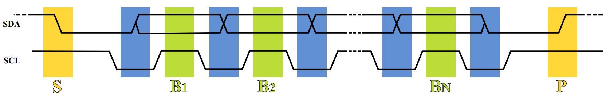

# I2C Application Note

# Purpose
The purpose of this document is to present to the user different possibilities to make use of the I2C bus to interface with the different I2C devices on Enclustra hardware.

# Summary
This document gives an overview of the I2C bus in general and lists all the different devices present on Enclustra hardware and their capabilities (in terms of I2C communication). A bare metal section shows examples and code snippets to implement I2C communication on the hardware. In the Linux section available drivers and the corresponding device tree entries are shown and presented.

# License
Copyright 2020 by Enclustra GmbH, Switzerland.

Permission is hereby granted, free of charge, to any person obtaining a copy of this hardware, software,
firmware, and associated documentation files (the ”Product”), to deal in the Product without restriction, including
without limitation the rights to use, copy, modify, merge, publish, distribute, sublicense, and/or sell
copies of the Product, and to permit persons to whom the Product is furnished to do so, subject to the
following conditions:

The above copyright notice and this permission notice shall be included in all copies or substantial portions
of the Product.

THE PRODUCT IS PROVIDED ”AS IS”, WITHOUT WARRANTY OF ANY KIND, EXPRESS OR IMPLIED, INCLUDING
BUT NOT LIMITED TO THE WARRANTIES OF MERCHANTABILITY, FITNESS FOR A PARTICULAR PURPOSE
AND NONINFRINGEMENT. IN NO EVENT SHALL THE AUTHORS OR COPYRIGHT HOLDERS BE LIABLE FOR
ANY CLAIM, DAMAGES OR OTHER LIABILITY, WHETHER IN AN ACTION OF CONTRACT, TORT OR OTHERWISE,
ARISING FROM, OUT OF OR IN CONNECTION WITH THE PRODUCT OR THE USE OR OTHER DEALINGS
IN THE PRODUCT.

# Introduction
This chapter introduces the I2C bus and gives general information about the communication protocol. Furthermore, the I2C hardware chips used on Enclustra boards and modules are introduced. A table of all present I2C devices and the corresponding addresses can be found in the respective user manual of the hardware used.

## General information
I2C is a low speed, low cost and simple bus mostly used for inter peripheral communication. It is a Master-Slave communication scheme needing just two bidirectional open drain signals, SCL and SDA. When no data transfer is taking place, both lines are pulled up. The number of nodes is limited by the address space and the total bus capacitance of 400 pF. The figure below shows an example data transfer procedure.

1. **SDA** being pulled low while **SCL** stays high signifies the start bit (**S**) of a data transfer.
2. **SCL** is pulled low and the first data bit is set by **SDA** while **SCL** is kept low (during blue bar time).
3. Data is sampled when **SCL** rises for the first bit (**B1**). **SDA** has to hold the data for the entire duration of the green bar for the bit to be valid.
4. This process repeats: **SDA** transitions between the low times of **SCL** and the data is sampled while **SCL** is high (**B2**, . . ., **BN**)
5. After the final bit a clock pulse follows during which **SDA** is pulled low in preparation for the stop bit.
6. A stop bit (**P**) is signaled when **SCL** rises, followed by **SDA** rising.

The types of I2C chips used in Enclustra hardware are described in more detail in **chapter 3**. The following chapter provides distinct examples on Enclustra hardware. The examples include sample code for all I2C devices used in Enclustra hardware.

# Table of contents
* [Chapter 1 - Examples](./Chapter-1-Examples.md)
    - [1.1 Mercury XU5 example](Chapter-1-Examples.md#11-mercury-xu5-example)
        - [1.1.1 EEPROM ATSHA204A-MAHDA-T](Chapter-1-Examples.md#111-eeprom-atsha204a-mahda-t)
        - [1.1.2 System monitor Texas Instruments LM96080CIMT/NOPB](Chapter-1-Examples.md#112-system-monitor-texas-instruments-lm96080cimt/nopb)
        - [1.1.3 Clock generator Silicon Labs Si5338](Chapter-1-Examples.md#113-clock-generator-silicon-labs-si5338)
    - [1.2 Mars ZX2 example](Chapter-1-Examples.md#12-mars-zx2-example)
        - [1.2.1 RTC PCF85063A](Chapter-1-Examples.md#121-rtc-pcf85063a)
        - [1.2.2 System controller Lattice LCMXO2-4000HC-6MG132I](Chapter-1-Examples.md#122-system-controller-lattice-lcmx02-4000hc-6mg123i)
    - [1.3 Cosmos XZQ10 system board example](Chapter-1-Examples.md#13-cosmos-xzq10-system-board-example)
        - [1.3.1 RTC ISL12020M](Chapter-1-Examples.md#131-rtc-isl12020m)
        - [1.3.2 8-channel bus multiplexer NXP PCA9547](Chapter-1-Examples.md#132-8-channel-bus-multiplexer-nxp-pca9547)
        - [1.3.3 EEPROM 24AA128T-I/MNY](Chapter-1-Examples.md#133-eeprom-24aa128t-i/mny)
* [Chapter 2 - I2C device description](./Chapter-2-I2CDeviceDescription.md)
    - [2.1 EEPROM](Chapter-2-I2CDeviceDescription.md#21-eeprom)
        - [2.1.1 - Microchip ATSHA204A-MAHDA-T](Chapter-2-I2CDeviceDescription.md#211-microchip-atsha204a-mahda-t)
        - [2.1.2 - Maxim DS28CN01U-A00+](Chapter-2-I2CDeviceDescription.md#212-maxim-ds28cn01u-a00+)
        - [2.1.3 - Microchip 24AA128T-I/MNY](Chapter-2-I2CDeviceDescription.md#213-microchip-24aa128t-i/mny)
    - [2.2 RTC](Chapter-2-I2CDeviceDescription.md#22-rtc)
        - [2.2.1 - ISL12020M](Chapter-2-I2CDeviceDescription.md#221-isl12020m)
        - [2.2.2 - PCF85063A](Chapter-2-I2CDeviceDescription.md#222-pcf85063a)
    - [2.3 System Controller Lattice LCMXO2-4000HC-6MG132I](Chapter-2-I2CDeviceDescription.md#23-system-controller-lattice-lcmxo2-4000hc-6mg132i)
    - [2.4 System Monitor Texas Instruments LM96080CIMT/NOPB](Chapter-2-I2CDeviceDescription.md#24-system-monitor-texas-instruments-lm96080cimt/nopb)
    - [2.5 Clock generator Silicon Labs Si5338](Chapter-2-I2CDeviceDescription.md#25-clock-generator-silicon-labs-si5338)
    - [2.6 8-channel bus multiplexer NXP PCA9547](Chapter-2-I2CDeviceDescription.md#26-8-channel-bus-multiplexer-nxp-pca9547)
* [Chapter 3 - Bare metal](./Chapter-3-BareMetal.md)
    - [3.1 - EEPROM](Chapter-3-BareMetal.md#31-eeprom)
        - [3.1.1 - ATSHA204A-MAHDA-T](Chapter-3-BareMetal.md#311-atsha204a-mahda-t)
        - [3.1.2 - DS28CN01U-A00+](Chapter-3-BareMetal.md#312-ds28cn01u-a00+)
        - [3.1.3 - 24AA128T-I/MNY](Chapter-3-BareMetal.md#313-24aa128t-i/mny)
    - [3.2 - RTC](Chapter-3-BareMetal.md#32-rtc)
        - [3.2.1 - Helper functions](Chapter-3-BareMetal.md#321-helper-functions)
        - [3.2.2 - ISL12020M](Chapter-3-BareMetal.md#322-isl12020m)
        - [3.2.3 - PCF85063A](Chapter-3-BareMetal.md#322-pcf85063a)
    - [3.3 - System Controller Lattice LCMXO2-4000HC-6MG132I](Chapter-3-BareMetal.md#33-system-controller-lattice-lcmx02-4000hc-6mg123i)
    - [3.4 - System Monitor LM96080CIMT/NOPB](Chapter-3-BareMetal.md#36-system-monitor-texas-instruments-lm96080cimt/nopb)
    - [3.5 - Clock Generator Si5338](Chapter-3-BareMetal.md#35-clock-generator-si5338)
    - [3.6 - 8-channel bus multiplexer NXP PCA9547](Chapter-3-BareMetal.md#36-8-channel-bus-multiplexer-nxp-pca9547)
* [Chapter 4 - U-boot](./Chapter-4-U-boot.md)
* [Chapter 5 - Linux](./Chapter-5-Linux.md)
    - [5.1 - EEPROM](Chapter-5-Linux.md#51-eeprom)
    - [5.2 - RTC](Chapter-5-Linux.md#52-rtc)
    - [5.3 - System Controller Lattice LCMXO2-4000HC-6MG132I](Chapter-5-Linux.md#53-system-controller-lattice-lcmx02-4000hc-6mg123i)
    - [5.4 - System Monitor LM96080CIMT/NOPB](Chapter-5-Linux.md#54-system-monitor-texas-instruments-lm96080cimt/nopb)
    - [5.5 Clock generator Silicon Labs Si5338](Chapter-5-Linux.md#55-clock-generator-silicon-labs-si5338)
    - [5.6 8-channel bus multiplexer NXP PCA9547](Chapter-5-Linux.md#56-8-channel-bus-multiplexer-nxp-pca9547)
    - [5.7 Linux I2C tools](Chapter-5-Linux.md#57-linux-i2c-tools)

# References
* [I2C wikipedia article](https://en.wikipedia.org/wiki/I%C2%B2C)
